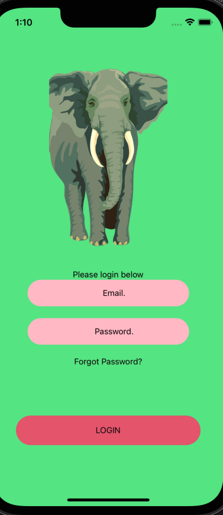

# VICSR Frontend #

## Development Dependencies (mac) ##
From [here](https://reactnative.dev/docs/environment-setup), under mac/iOS settings
- Node
- Watchman
- the React Native command line interface 
- Xcode 
- CocoaPods

## Development Running and Testing ##

- Follow the steps in the link above to set up your development environment UNTIL the header "Creating a new application"
- Then, clone the branch included the frontend code that you want to work on
- From project root 
- ```cd frontend```
- ```cd VICSRfrontend```
- Run Metro, the javascript bundler that ships with react native
- This also gives you a debugger
- To do so, run the following command, included in Node:
- ```npx react-native start```
- I had to do this before mine ran, (macOS 11.6.1) (node v16.14.0)
- run: ```cd ios``` and then ``` pod install``` and finally, ```cd ..```
- Then run the following to start the IOS simulator and run the app:
- ```npx react-native run-ios```

## Screenshots ##
